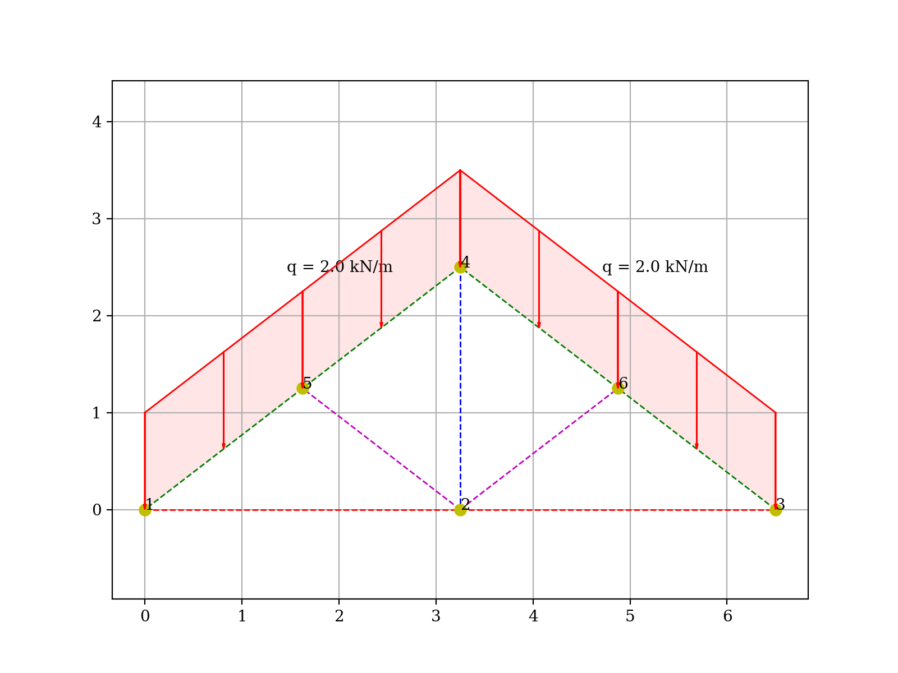

<p align="center">

</p>

# Flask_EC5 (ver. 0.1 "Fox"): Code élément fini en Python
## Objectives
Réaliser un code de calcul élément fini simple.

Continuous Integration:<br/>
[](https://github.com/su2code/SU2/actions)
[](https://github.com/su2code/SU2/actions)

Code Quality:<br/>
[](https://www.codefactor.io/repository/github/su2code/su2)

Elle s'appuie sur : 
* [Vidéo Element fini 2D](https://www.youtube.com/user/TheMisterM123) : chaine de Mahdi Farahikia avec de très bonnes vidéos

# Installation

## Build the code
Short summary of the minimal requirements:

- Python 3
- numpy
- matplotlib
- prettytable
- mpl_toolkits

**Note:** all other necessary build tools and dependencies are shipped with the source code or are downloaded automatically.

Tout d'abord, il faut installer un ensemble de fichiers en utilsiant la commande :
>pip install fem_model

Pour gagner du temps, j'ai créé un script batch qui lance l'installation de tous les package nécessaire pour cela faire :

```Bash
run pack_install.bat
pip install -r requirement.txt
```

Next

# TO DO
## Release v1.0
**date :** 25/06/2022\
Voici ce que va contenir cette release : 
* [x] Possibilité de réaliser un maillage :
   * [x] 2D
   * [x] 3D
   * [ ] Possibilité de charge un maillage à partir d'un fichier .txt
* [ ] Post-traitement des résultats
    * [ ] Affichage des déformées
    * [ ] Affichage des contraintes
* [ ] Un script dédier pour l'affichage des résultats

## Release v2.0
**date :** 25/12/2022\
Contenu de la release : 
* [ ] blabla

## Copyright and License

(c) 2021 Gameiro Nicolas. All content is under Creative Commons Attribution [CC-BY 4.0](https://creativecommons.org/licenses/by/4.0/legalcode.txt), and all [code is under BSD-3 clause](https://github.com/engineersCode/EngComp/blob/master/LICENSE)

[](https://opensource.org/licenses/BSD-3-Clause) [](https://creativecommons.org/licenses/by/4.0/)
